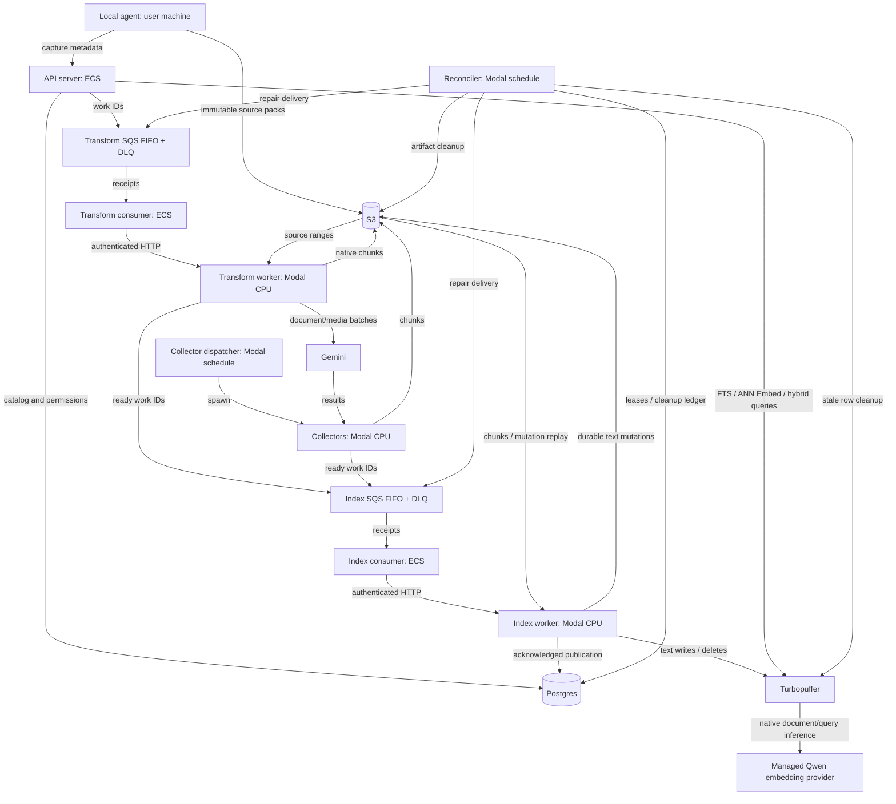

# PufferFS Architecture and Functionality

PufferFS runs an API server, two queue consumers, transformation workers,
a collector dispatcher and collectors, a CPU index worker, and a reconciler.
They share a repository and deploy independently. Modal hosts CPU workers;
ECS hosts the API and consumers. Turbopuffer generates document and query
embeddings with `qwen/qwen3-embedding-8b`, 4096 float32 dimensions.

## Deployment topology

DLQ means dead-letter queue: messages whose delivery attempts are exhausted.

| Role | Hosting / trigger | Input → output / handoff |
| --- | --- | --- |
| Local agent | User machine; sync/watch | Files → S3 packs and API version registration |
| API server | ECS; authenticated HTTP | Capture metadata → Postgres and transform SQS; queries → Turbopuffer |
| Transform consumer | ECS; polls transform SQS | Receipts → bounded worker HTTP calls; renews visibility and acknowledges durable results |
| Transform worker | Modal CPU; HTTP | S3 originals → native chunks or Gemini batches; ready extractions → index SQS |
| Collector dispatcher | Modal CPU; minute schedule | Configured count → spawned collector invocations |
| Collectors | Modal CPU; dispatcher | Leased Gemini work → S3 text, durable batch state, index SQS and provider cleanup |
| Index consumer | ECS; polls index SQS | Receipts → one authenticated index endpoint |
| Index worker | Modal CPU; HTTP | S3 chunks → durable text mutations → Turbopuffer → Postgres publication |
| Reconciler | Modal CPU; minute schedule | Durable records → repaired delivery and source/artifact/index cleanup |

ECS starts the consumers; they receive SQS receipts and invoke HTTP workers.
Workers claim a Postgres lease before processing. Modal starts/scales worker
containers and invokes scheduled functions. The collector dispatcher starts
collectors explicitly. Four Modal applications contain these CPU roles:
`transform_app`, `collector_app`, `index_app`, `reconciliation_app`.

## Durable publication

Postgres retains tenants, permissions, source references, file/version/extraction
identities, work leases, provider-batch coordination, namespace routing and cleanup
records. It is not the work queue. SQS carries bounded IDs, not source bodies.

S3 retains original packs, source manifests, ordered extracted text, provider
manifests and replayable text mutations. Rendered pages and converted media are
temporary. Embedding vectors live in Turbopuffer; there is no local vector cache.

Index rows have stable extraction-specific IDs. The index worker persists each
mutation artifact before writing, then publishes the catalog head only after
all writes succeed. An interrupted attempt replays its durable text; native
inference may run again. Search validates candidates against published catalog
heads; reads pin one publication across pages. Late/stale writes are hidden and
removed by recurring cleanup. Root deletion leaves permanent cleanup identities.

Vector-enabled schemas embed `content` into `vector`. Queries use
`["content", "ANN", ["Embed", query]]`; hybrid mode retains ANN/BM25 fusion.
Vector-disabled roots omit native embedding, using the same CPU worker and FTS.
The API no longer calls an embedding service or holds query vectors. Namespace
fan-out and publication retries can issue multiple native inference requests.

## Operations and verification

[Deployment](production-deployment.md) describes the clean cutover from the
retired Nomic stack. Old supplied-vector mutation artifacts cannot replay in the
new worker. Migration 047 drops the old embedding pack directory after old
writers and authorized cache objects have been retired.

Compose runs the same production entrypoints as separate processes with real
Postgres, LocalStack S3/SQS and real Gemini/Turbopuffer providers. Cloud E2E adds
real AWS and Modal CPU execution. Read the [E2E record](../tests/e2e/README.md)
for actual results and differences from production.

See [formats](file-ingestion-and-chunking.md), [API](api-reference.md),
[configuration](configuration.md) and [security](security-and-data-handling.md).
