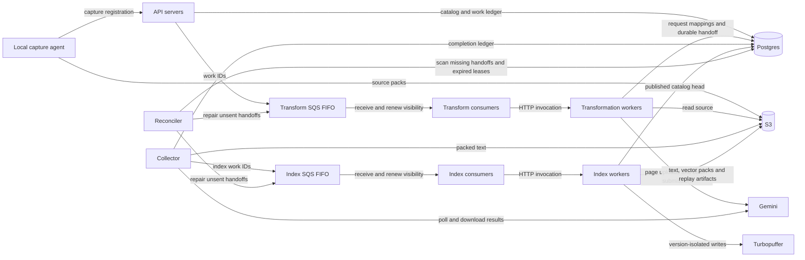

# Baseline capacity assessment: one million 100-page files

**Historical baseline, before the S3 batch-manifest redesign.** The user’s actual
workload is one million mixed-format files averaging 100 pages. The numerical
example below intentionally isolates the all-provider, exactly-100-input case;
it is not an exact mixed-format forecast. See [the implemented redesign and
revised accounting](provider-batch-manifests.md) for the current worktree.

Assessment of the pre-redesign local worktree on 2026-09-07, not a production load
test or verification of deployed settings. The current sync-to-index path is
not ready for an unrestricted import of this size. Bounded SQL statements
prevent a single enormous INSERT, but do not bound the backlog, total metadata,
provider usage, result-set sizes or time to completion.

Assume one initial capture of 1,000,000 PDFs, each requiring the existing
100-page visual/provider transformation; no failures, retries or updates.
For vector calculations only, assume one unique chunk per page and 768 float32
dimensions. Actual chunk counts, bytes and inference costs depend on content.

## Current roles and handoffs

| Separately deployable role | Hosting / trigger in code | Consumes → produces |
| --- | --- | --- |
| Local capture agent | User machine; CLI sync/follow | Filesystem → source packs, API captures, local heads |
| API servers | Server containers; HTTP | Authenticated captures → Postgres ledger and SQS messages |
| Transform consumers | Server worker processes; SQS receive | Transform messages → worker HTTP calls and receipt acknowledgements |
| Transformation workers | Modal CPU endpoint; HTTP | S3 source → temporary provider uploads, batches and request mappings |
| Collector | Modal scheduled function; once/minute, maximum one container | Provider status/results → S3 chunks, completion state and index messages |
| Index consumers | Server worker processes; SQS receive | Index messages → worker HTTP calls and receipt acknowledgements |
| Index workers | Modal CPU or GPU endpoints; HTTP | S3 chunks → vectors/replay artifacts, Turbopuffer rows and published heads |
| Reconciler | Separate Modal scheduled function; once/minute, maximum one container | Recovery/cleanup ledger → queue repairs and durable cleanup |

The consumers claim queue receipts and invoke endpoints; the hosting platform
starts endpoint workers. API replicas do not themselves execute transformations.
The code defaults permit up to 32 transformation containers and 16 containers
per index deployment. These are ceilings, not measured sustained capacity.
Compose tests run the production entrypoints as separate local processes;
GPU hosting has separate smaller cloud tests. No million-file run exists.

## Work and storage multiplication

| Quantity | Initial workload under the assumptions above |
| --- | ---: |
| Pages / provider requests | 100,000,000 |
| Provider batch jobs, 64 + 36 pages per file | 2,000,000 |
| Uploaded page images | 100,000,000 |
| Uploaded batch JSONL files | 2,000,000 |
| `provider_requests` rows | 100,000,000 |
| `provider_files` rows | 102,000,000 |
| `provider_batch_files` rows | 102,000,000 |
| `provider_batches` rows | 2,000,000 |
| Core catalog/version/extraction/work rows | 5,000,000 |
| Cold embedding packs, one per 100-chunk file | 1,000,000 |
| Raw vectors in those packs | 307.2 GB, decimal |
| Vector base64 characters in mutation payloads, before gzip | 409.6 GB, decimal |

Provider bookkeeping alone is approximately 306 million rows, excluding
secondary indexes, row versions, WAL, retries, source extents and proofs.
Marking a provider upload deleted does not remove its bookkeeping row.
Text remains in S3, but the database still tracks every page and upload.
At this shape there are about five million provider-result, assembled-text,
mutation and embedding objects, in addition to source packs/manifests.
Packing is currently per file/batch; 512 is a maximum, not a cross-file fill target.

Capture has at most 128 files and a 4 MiB request body per registration.
Provider reservation has at most 64 mappings. The latest change reduces
reservation from 204 to eight SQL statements per 100-page file: approximately
196 million fewer statements over this scenario. It does not eliminate the
100 million per-page heartbeat UPDATEs or 100 million upload-registration
transactions still issued by preparation, nor the corresponding durable rows.

## Capacity and correctness gaps

1. **Provider admission is not coordinated across workers.** Workers upload
   pages and submit batches directly. Google's documented limits include 100
   concurrent batch requests and 20 GB of uploaded file storage; model/tier
   token limits also apply. The actual account's capacity has not been checked.
   Explicit submission rejections are not separated from ambiguous accepted
   requests in the current submission marker/listing recovery path. Work can
   remain awaiting reconciliation when no provider job was created.
   Sources: [rate limits](https://ai.google.dev/gemini-api/docs/rate-limits),
   [Files API](https://ai.google.dev/gemini-api/docs/files).

2. **Collection is a serial capacity ceiling.** `collector_app.py` selects at
   most 50 provider batches and 50 waiting extractions per scheduled invocation.
   At one invocation/minute, two million batches require at least 27.8 days
   even if each needs only one terminal check. One million assemblies require
   at least 13.9 days. Repeated pending polls, network time and long invocations
   reduce capacity further. These are optimistic service-capacity calculations,
   not predicted completion times; the stages overlap and their times are not
   simply added.

3. **An SQS backlog is not indefinite durable scheduling.** SQS retention is
   at most 14 days; test provisioning uses that maximum, while production
   settings have not been inspected. `publish_pending` repairs only null
   `enqueued_at`; `reconcile_file_work` deliberately leaves previously sent
   messages to SQS. If a waiting message expires, its retained source and work
   row do not currently cause automatic redispatch. Capture needs durable
   admission/checkpointing that keeps queue age within retention without
   bypassing retry/DLQ policy. [AWS retention documentation](https://docs.aws.amazon.com/AWSSimpleQueueService/latest/SQSDeveloperGuide/sqs-configure-queue-parameters.html).

4. **Cleanup cannot drain at this scale.** Provider cleanup selects at most
   64 uploads for deletion per collector invocation, with a 30-second budget.
   At an ideal 64/minute, 102 million deletions represent about 1,107 days.
   Uploads actually expire automatically after 48 hours; this arithmetic
   describes explicit cleanup capacity, not how long Google retains them.
   Local expiry marking is also capped at 64 per invocation. Generated batch
   results expire after six weeks, so timely collection is required before
   the result becomes durable in S3.
   Sources: [upload expiry](https://ai.google.dev/gemini-api/docs/files#delete-uploaded-files),
   [result retention](https://ai.google.dev/gemini-api/docs/batch-api#retrieving-results).

5. **Some reads still grow with the dataset.** `embedding_artifacts.py` fetches
   every overlapping cache pack and sorts them in memory; a common content
   hash can match many packs despite the 512-hash input limit and GIN index.
   `capture_sync.go` accumulates full-root remote/base/cache maps and candidate
   lists, then sorts before uploading bounded batches. One million files in
   one root therefore still create substantial local memory and filesystem IO.
   Ambiguous provider submission recovery also lists provider jobs to locate
   a display name; that operation is not bounded by the current batch size.

6. **Shared locks and connections limit horizontal gains.** Capture and final
   index publication serialize on a root row. Distribution across roots helps;
   extra servers do not remove a hot-root lock. Each worker can open its own
   two-connection database pool, so fleet concurrency needs a database budget.
   The CPU index role currently recreates its provider client per request,
   adding connection setup work; GPU indexing retains its client.

7. **Small tests do not establish index capacity for this corpus.** The latest
   single-worker cold-cache benchmark measured about 39 chunks/second on a
   four-file, 968-chunk synthetic workload. Dividing 100 million by that rate
   gives roughly 30 worker-days, but is only an illustration: document sizes,
   model throughput, provider contention and metadata volume differ here.
   More than one chunk/page multiplies vector and index work accordingly.

## Required direction before this bulk workload

Keep the bounded SQL/S3 operations, but make durable admission and queue-age
recovery explicit; coordinate provider capacity; distribute collector and
cleanup work through independently claimable bounded tasks. Move page/input
mapping bulk data to immutable S3 manifests with compact per-file/batch progress
in Postgres, preserving exact retry and cleanup identities. Reduce per-page
network and heartbeat operations without losing ownership checks. Bound cache
lookup results and replace full-root in-memory capture planning with paginated
or disk-backed state. Preserve cross-server ownership and version isolation.

Then validate large-catalog query plans, sustained backlog drain, provider
throttling, queue expiry, restarts and cleanup capacity through production E2E
processes. These are outstanding requirements, not implemented changes or
claims of verification. No production deployment or bulk import was performed
for this assessment.
