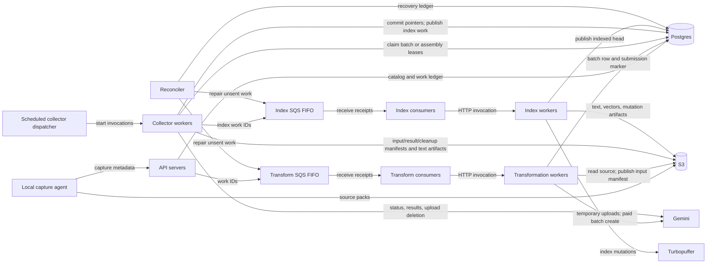

# Provider batch manifests

This describes the local redesign, not the deployed system. No production
schema update, deployment, or million-file import has been performed. The
schema intentionally has no conversion path from the previous provider ledger.
See the [compatibility-removal audit](fresh-schema-audit.md) for subsequent
removal of the emptiness gate and adjacent migration paths.

## Roles and deployment

The API servers register captures and enqueue transformation work. Separate
transformation consumers receive SQS messages and invoke transformation workers.
A scheduled dispatcher starts collector workers; collectors claim independent
provider batches and extraction assemblies. Index consumers receive the
resulting index messages and invoke index workers. One codebase supplies these
separately deployed roles; each role can have multiple runtime processes.

| Role | Hosting and trigger | Consumes → produces / handoff |
| --- | --- | --- |
| Local capture agent | User machine; CLI sync/follow | Files → S3 source packs and API captures |
| API servers | Server containers; HTTP | Captures → catalog/work rows and transform SQS messages |
| Transform consumers | Server processes; SQS receive | Receipts → transform endpoint calls and acknowledgements |
| Transformation workers | Modal CPU endpoint; HTTP | Immutable source → uploads, S3 input manifest, batch coordination |
| Collector dispatcher | Modal scheduled function; every minute | Configured worker count → independent collector invocations |
| Collector workers | Modal CPU functions; dispatcher invocation | Due batches/assemblies → S3 results/checkpoints and index SQS messages |
| Index consumers | Server processes; SQS receive | Receipts → index endpoint calls and acknowledgements |
| Index workers | Modal CPU/GPU endpoint; HTTP | Extracted chunks → Turbopuffer data and published catalog head |
| Reconciler | Separate Modal scheduled role | Committed unsent work → repaired SQS delivery |

Consumers receive queue receipts; the hosting platform starts endpoint workers.
Collector follow-up work is coordinated by batch leases in Postgres, not by a
new per-page queue. Compose runs these production entrypoints in separate local
processes and invokes collector ticks every minute. It does not exercise Modal's
remote dispatcher or autoscaler.

## Durable representation

`provider_batches` is the only provider bookkeeping table. Each row covers a
contiguous range of at most 64 source inputs. It retains the extraction/owner
identity, range/count, model, attempt/status, current provider job ID, submission
marker, lease, scheduling timestamps, a bounded discovery cursor, and three S3
pointers. Retry attempts reuse the same row. There are no `provider_requests`, `provider_files`, or
`provider_batch_files` tables in the resulting schema.

S3 stores:

- **Input manifest:** up to 64 ordered request mappings and up to 65 upload
  identities/expiry timestamps (inputs plus the JSONL envelope). Includes a
  pointer to the previous input manifest when inputs are regenerated.
- **Result manifest:** the complete range's success/failure state and references
  to packed text artifacts, including successes retained from earlier attempts.
  Records the provider job ID and previous result manifest for audit/recovery.
- **Cleanup checkpoint:** up to 65 exact upload deletion/expiry/error outcomes,
  the next input manifest to clean, and the previous checkpoint.

Metadata objects use content-addressed keys under `maintenance/provider/<batch>/`
with a hard 4 MiB limit. Readers verify the checksum, batch identity, range, and
referenced result ownership. Cleanup identities survive root/catalog deletion
because this prefix is outside the source and extraction erasure prefixes.
Detailed data can grow in S3; neither a SQL row nor an individual manifest grows
with the full file or corpus. Uncommitted manifests may remain as S3 orphans;
there is no automatic orphan-manifest garbage collector in this change.

Source formats retain their ordinary paths: PDF/Office/presentation pages and
image frames use visual requests; audio/video use clips; text/JSONL, spreadsheets,
and structured contacts/messages use native extraction. A page is not necessarily
one provider input or one searchable chunk.

## Preparation, submission and recovery

1. Read and verify the captured source. Render/decode a bounded input range.
2. Upload inputs with bounded concurrency (default 4, configurable 1–16).
   Only the in-flight temporary files are retained on local disk. No database
   writes occur per input; the transformation work lease renews by elapsed time.
3. Upload the JSONL envelope and PUT one immutable input manifest.
4. Check the live transformation lease and insert one batch row referencing it.
5. Check current source ownership and atomically commit the paid-submission
   marker under the batch lease, before calling Gemini.
6. Record the returned provider job ID. Seal the file's total input count only
   after all its batch ranges have been submitted.

A crash before step 4 causes that uncommitted preparation batch to be repeated.
Unrecorded temporary provider uploads expire under the provider's retention
policy; the retry does not need to recover those individual IDs. The manifest
may already exist in S3, but an uncommitted object is not an authorized pointer.

After the submission marker, ambiguous failures are reconciled by the durable
provider display name. Each invocation reads at most two 100-job pages: the
saved history position and, if necessary, the newest page. Rechecking the newest
page catches delayed acceptance/visibility without waiting for a full history
scan. It checkpoints the history cursor (at most 8,192 characters) in the existing
batch row. It does not exhaust the SDK's automatically paginated iterator. A collector
restart resumes that cursor; an invalid cursor or end of scan restarts discovery
without clearing the paid-submission marker. Matching job discovery clears the
cursor. Collectors never blindly repeat a paid create. Explicit
validation/auth/quota rejections clear the marker for a later safe attempt.
If an ambiguous submission cannot be found, it remains unresolved: a negative
provider listing does not prove that creation failed. This limitation predates
the redesign and cannot be removed by batching storage writes.

Terminal partial failures publish their successful text and complete result
manifest before changing the batch status. A subsequent attempt regenerates
only incomplete inputs, in one batch, retaining successful artifact references.
There are at most three inference attempts. Lost preparation attempts do not
consume the paid-inference retry budget.

Collectors claim work using `FOR UPDATE SKIP LOCKED` and renewable five-minute
leases. Every input/result/cleanup pointer update checks the live token and
expected attempt/pointer. A stale worker can leave an immutable orphan object;
it cannot replace a newer committed pointer. Assembly streams batches in source
order, retaining at most one 64-input result window (64 MiB decoded bound), then
publishes the index handoff under its own renewed lease.

Upload cleanup deletes up to 65 uploads concurrently (8 outstanding requests),
then publishes one S3 checkpoint and one Postgres pointer update. Permission
errors do not count as deletion. If a deletion response/checkpoint is lost,
cleanup retries or waits for the recorded provider expiry; it does not invent
an acknowledgement. Older input generations are traversed one bounded manifest
at a time. Generated provider result files have their separate provider-managed
retention policy and are not treated as uploaded Files API resources.

## Bounded calls and capacity accounting

For a fresh successful provider file, define `B` as its number of 64-input
batches. Excluding work claim/source IO, background lease renewals, collection,
cleanup, and indexing, the preparation path issues **6B + 5 application SQL
statements in 4B + 2 transactions**. This is source-level accounting, not a TCP
packet trace. A 100-input file uses 17 statements / 10 transactions, versus
231 / 212 in the preceding per-input-ledger worktree.

For exactly one million files with exactly 100 provider inputs each, no retries:

| Quantity | Previous worktree | Batch manifest design |
| --- | ---: | ---: |
| Provider bookkeeping rows | 306 million | 2 million |
| Provider bookkeeping tables | 4 | 1 |
| Preparation SQL statements | 231 million | 17 million |
| Preparation transactions | 212 million | 10 million |
| New input-manifest PUTs | 0 | 2 million |
| New result-manifest PUTs | 0 | 2 million |
| New cleanup-checkpoint PUTs, one successful pass | 0 | 2 million |
| New metadata GETs on the successful path | 0 | 8 million |
| Provider input uploads | 100 million | 100 million |
| Provider JSONL uploads / paid jobs | 2 million each | 2 million each |

Existing packed text/result/source/vector/mutation objects and their traffic are
additional to the metadata counts. Polling, retry, lost responses, cleanup
failures, source expiry and long-running lease renewals add work. Mixed-format
corpora must use actual provider-input counts; an average of 100 pages does not
imply exactly two provider batches per file.

`PUFFERFS_COLLECTOR_WORKERS` is a deployment-time setting (default 1, range 1–16).
It sets both the concurrent collector-container cap and the number of collector
invocations dispatched each minute. One means at most one live collector
container, including when a slow invocation overlaps the next schedule. There is no fixed 50-batch/50-assembly cap.
Each invocation alternates collection, assembly and cleanup for a nominal
50-second work window; an individual long operation can extend it while renewing
its lease, within the 900-second function timeout. More collectors do not
increase provider account quotas.

## Verification

The recovery suite uses two API processes, two collector processes, one
transformation endpoint process, real Postgres, S3/SQS-compatible services and
real Gemini/Turbopuffer. External network relays delay actual S3 and Gemini
responses; no database workflow state or provider results are fabricated.
It covers uncommitted input publication, lost accepted submission, a 65-page
file crossing the batch boundary, interrupted result publication, partial
inference retry, public page read/search and S3 cleanup checkpoints. The broader
suite covers mixed formats, native paths, updates/deletes, authorization,
source/read/search fidelity, vector/hybrid indexing and process/network recovery.

Additional E2E suites cover root deletion while an accepted submission response
is in flight (`scripts/test-e2e-provider-deletion.sh`), and bounded negative
provider discovery followed by a collector restart and delayed acceptance of the
original request (`scripts/test-e2e-provider-discovery.sh`). The latter checks the
actual listing page size and matches the next request's cursor hash to the
committed checkpoint; provider responses remain unmodified.

Execution results are recorded separately after the runs finish. No million-file
load test, production deployment or Modal dispatch scaling test is implied.

### Execution record, 2026-09-07

- Full production-role Compose suite: run `791d76f7802a49a68ebc072fad691725`,
  all 15 reported phases passed, exit 0, resources cleaned. Main verification
  836.48 seconds; process/network restart recovery 58.30 seconds. Covered the
  1,024-file mixed-format corpus plus native/follow/recovery fixtures, original
  bytes, pages/text, FTS/vector/hybrid search, authorization, updates/deletes,
  multipart recovery and mixed malformed/valid SQS delivery.
- Root deletion during accepted provider submission: run
  `607d475301e04676a607f33ed9a0b5b5`, passed in 210.40 seconds; cleanup passed,
  exit 0, resources cleaned. The same paid job reached terminal state, all three
  uploads had acknowledged deletions, and no index work was resurrected.
- Intermediate discovery run `ba706b545f78480ba07c710b3d79fb73` verified a
  bounded negative listing and durable cursor, then was deliberately stopped
  when replaced by the implementation that also revisits the newest page.
  No final-discovery pass is claimed for that run. Its paid job was terminal,
  all three synthetic uploads were explicitly deleted, and teardown passed.

The full and deletion suites preceded the discovery-cursor addition; the
separate final discovery run validates that follow-up. Modal's dispatcher and
container-cap configuration are not exercised by local Compose invocations.

- Batch-manifest recovery suite: run `ef4c5e92cfde43279f6d26c0de8c1b38`,
  all phases passed, exit 0, resources cleaned. Verified a crash after the input
  S3 PUT but before its Postgres publication; a lost accepted 64-input job
  response in a 65-page file; a crash after result S3 PUT but before publication;
  failed-input-only retry in the same row; preserved successful artifact ETags;
  ordered pages and FTS through two API processes. Four batch rows covered 86
  original inputs and the partial retry reused its row. Cleanup acknowledged
  91 upload deletions and retained two externally deleted uploads as ambiguous
  403s with unchanged future expiry deadlines. Synthetic uncommitted uploads
  known to the external relay were explicitly deleted during teardown.
  Input-publication recovery took 454.03 seconds, accepted-job recovery 717.54
  seconds, interrupted-result recovery 269.86 seconds, and partial retry through
  search/cleanup 733.19 seconds; these include real lease/provider waits.
- A 17-page synthetic preparation invocation in that run took 9.667 seconds,
  with 14 instrumented SQL statements and seven transactions including work
  claim and a connection health check. This is a small local observation, not
  a comparative throughput benchmark or a million-file capacity measurement.
- Final bounded discovery suite: run `3cd4185e7e104a86b21a22b47ed56162`,
  all phases passed, exit 0, resources cleaned. Observed exactly one paid create
  and three listing requests, each bounded to 100 jobs: initial newest page,
  saved history cursor after restart, and newest-page refresh. Recovered the
  original delayed job without reuploading inputs or duplicating inference.
  Both pages became readable/searchable and all three uploads had acknowledged
  deletions. Negative discovery took 270.38 seconds including the normal lease
  wait; final verification took 811.76 seconds including live provider completion
  and indexing; teardown passed in 1.04 seconds.
